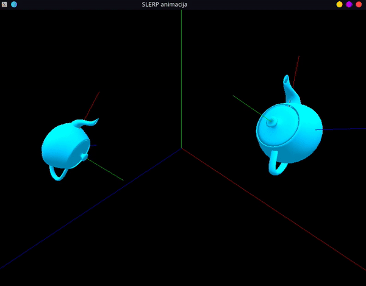
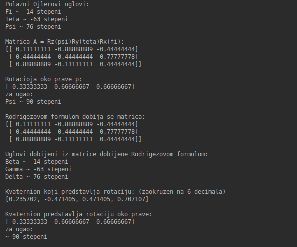

# Kretanje prostora i slerp animacija

## Slerp animacija:

## Testiranje funkcija

- Funkcije prikazuju rad sa Ojlerovim uglovima, odnosno kako se od njih može dobiti matrica rotacije
- Zatim kako se iz dobijene matrice dobijaju prava i ugao rotacije
- Nakon toga kako se može iz dobijenih prave i ugla Rodrigezovom formulom dobiti matrica rotacije
- I na kraju kako se iz matrice rotacije mogu dobiti Ojlerovi uglovi, čime se obrće krug i trebalo bi da se dobiju polazni uglovi

- Takođe, može se testirati kako od prave i ugla da se dobije odgovarajući kvaternion
- I obrnuto, od kvaterniona prava i ugao 
